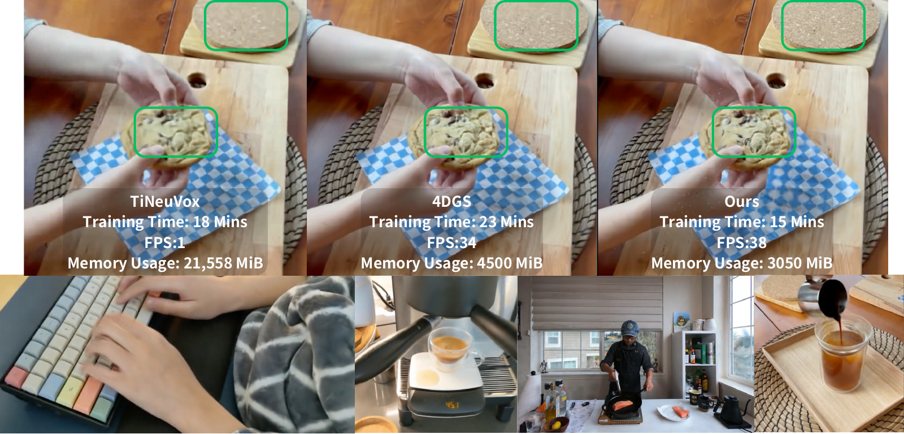
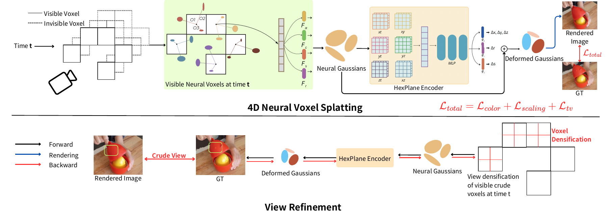

# 4D Neural Voxel Splatting

## ICIP 2026

### [Project Page](TBD) | [Paper](TBD) | [arXiv](TBD)

<p align="center">
  
</p>

**4D Neural Voxel Splatting** combines the compact neural-voxel anchor representation
of Scaffold-GS with the multi-resolution HexPlane temporal deformation of 4D Gaussian
Splatting, yielding a memory-efficient, temporally-coherent 4D scene representation
for real-time dynamic novel-view synthesis.

📄 [Teaser (PDF)](assets/Teaser.pdf) &nbsp;·&nbsp; [Method Overview (PDF)](assets/Overview.pdf)

---

## Method Overview

<p align="center">
  
</p>

---

## Supplementary Videos

| | |
| --- | --- |
| [Appendix 1](assets/Appendix_1.mp4) | [Appendix 2](assets/Appendix_2.mp4) |
| [Appendix 3](assets/Appendix_3.mp4) | [Appendix 4](assets/Appendix_4.mp4) |

> Videos are stored via Git LFS — clone with LFS support to download them, or
> view them on the GitHub web UI.

---

## Key Features

- Anchor-based neural voxel representation — Gaussians are *generated* per view from
  a small set of learnable anchors, not stored explicitly.
- Multi-resolution HexPlane deformation field for temporal modeling.
- Two-stage training: coarse geometry → fine temporal detail.
- Datasets: D-NeRF (synthetic), HyperNeRF, DyNeRF, custom multi-view captures.
- In-tree fused depth-aware Gaussian rasterizer (no external submodules).

---

## Installation

### Prerequisites
- CUDA 12.1
- Python 3.12
- A CUDA-capable GPU with compute capability ≥ 7.0

### Setup

```bash
# 1. Clone
git clone https://github.com/<your-org>/4d-neural-voxel-splatting.git
cd 4d-neural-voxel-splatting

# 2. Create a Python environment (conda or venv)
conda create -n 4dnvs python=3.12 -y
conda activate 4dnvs

# 3. Install Python dependencies
pip install -r requirements.txt \
    --extra-index-url https://download.pytorch.org/whl/cu121 \
    -f https://data.pyg.org/whl/torch-2.2.0+cu121.html \
    -f https://download.openmmlab.com/mmcv/dist/cu121/torch2.2/index.html

# 4. Build the in-tree CUDA extensions
pip install -e submodules/diff-gaussian-rasterization
pip install -e submodules/simple-knn
```

> The rasterizer (`submodules/diff-gaussian-rasterization`) and the spatial-search
> kernels (`submodules/simple-knn`) are vendored, not git submodules — there is
> no `git submodule update --init` step.

---

## Data Preparation

### Synthetic — D-NeRF
Download from the [D-NeRF repository](https://github.com/albertpumarola/D-NeRF).

### Real dynamic — HyperNeRF
Download scenes from [HyperNeRF v0.1](https://github.com/google/hypernerf/releases/tag/v0.1)
and organize them in [Nerfies](https://github.com/google/nerfies#datasets) format.

### Multi-camera real — DyNeRF (Plenoptic Video)
Download from [Neural 3D Video](https://github.com/facebookresearch/Neural_3D_Video)
and extract per-camera frames.

Expected layout:

```
data/
├── dnerf/
│   ├── mutant/
│   ├── standup/
│   └── ...
├── hypernerf/
│   ├── interp/
│   ├── misc/
│   └── virg/
└── dynerf/
    ├── cook_spinach/
    │   ├── cam00/images/0000.png
    │   ├── cam00/images/0001.png
    │   ├── cam01/images/0000.png
    │   └── ...
    └── cut_roasted_beef/
```

### Custom multi-view captures
Organize as:

```
data/multipleview/<scene>/
    cam01/frame_00001.jpg
    cam02/frame_00001.jpg
    ...
```
Then run:
```bash
bash multipleviewprogress.sh <scene>
```
which produces `sparse_/`, `points3D_multipleview.ply`, and `poses_bounds_multipleview.npy`
under the scene directory.

---

## Training

### D-NeRF (synthetic)
```bash
python train.py -s data/dnerf/bouncingballs \
    --port 6017 \
    --expname dnerf/bouncingballs \
    --configs arguments/dnerf/bouncingballs.py
```

### DyNeRF (real, requires preprocessing)
```bash
python scripts/preprocess_dynerf.py --datadir data/dynerf/cut_roasted_beef
bash colmap.sh data/dynerf/cut_roasted_beef llff
python scripts/downsample_point.py \
    data/dynerf/cut_roasted_beef/colmap/dense/workspace/fused.ply \
    data/dynerf/cut_roasted_beef/points3D_downsample2.ply
python train.py -s data/dynerf/cut_roasted_beef \
    --port 6017 \
    --expname dynerf/cut_roasted_beef \
    --configs arguments/dynerf/cut_roasted_beef.py
```

### HyperNeRF
```bash
bash colmap.sh data/hypernerf/virg/broom2 hypernerf
python scripts/downsample_point.py \
    data/hypernerf/virg/broom2/colmap/dense/workspace/fused.ply \
    data/hypernerf/virg/broom2/points3D_downsample2.ply
python train.py -s data/hypernerf/virg/broom2 \
    --port 6017 \
    --expname hypernerf/broom2 \
    --configs arguments/hypernerf/broom2.py
```

### Custom multi-view
Provide `arguments/multipleview/<scene>.py`, then:
```bash
python train.py -s data/multipleview/<scene> \
    --port 6017 \
    --expname multipleview/<scene> \
    --configs arguments/multipleview/<scene>.py
```

> Tip: downsample point clouds to under ~40k points for optimal memory and
> convergence.

---

## Checkpointing

```bash
# Save at iteration 200
python train.py ... --checkpoint_iterations 200

# Resume
python train.py ... --start_checkpoint output/<expname>/chkpnt_coarse_200.pth
python train.py ... --start_checkpoint output/<expname>/chkpnt_fine_200.pth
```

---

## Rendering & Evaluation

```bash
# Render
python render.py --model_path output/dnerf/bouncingballs/ \
    --skip_train --configs arguments/dnerf/bouncingballs.py

# Metrics (PSNR / SSIM / LPIPS)
python metrics.py --model_path output/dnerf/bouncingballs/
```

### Per-frame Gaussian export
```bash
python export_perframe_3DGS.py --iteration 14000 \
    --configs arguments/dnerf/lego.py \
    --model_path output/dnerf/lego
```

### Interactive viewer
See [`docs/viewer_usage.md`](./docs/viewer_usage.md) for the SIBR-based viewer.

---

## Repository Layout

```
arguments/         # per-dataset training configs
gaussian_renderer/ # render + neural-Gaussian generation
scene/             # GaussianModel, deformation, dataset readers
scripts/           # preprocessing utilities
submodules/
  diff-gaussian-rasterization/  # vendored CUDA rasterizer
  simple-knn/                   # vendored kNN/spatial kernels
SIBR_viewers/      # interactive viewer (optional, see docs/)
utils/             # general utilities
train.py           # training entry point
render.py          # rendering entry point
metrics.py         # evaluation
```

---

## Acknowledgments

This work builds on:
- [3D Gaussian Splatting](https://github.com/graphdeco-inria/gaussian-splatting) — core differentiable rasterization
- [Scaffold-GS](https://github.com/city-super/Scaffold-GS) — anchor-based neural Gaussian generation
- [4D Gaussian Splatting](https://github.com/hustvl/4DGaussians) — temporal HexPlane deformation
- [HexPlane](https://github.com/Caoang327/HexPlane) — multi-resolution plane factorization
- [K-Planes](https://github.com/Giodiro/kplanes_nerfstudio) — plane-based neural fields

---

## Citation

```bibtex
@inproceedings{TBD,
  title     = {4D Neural Voxel Splatting},
  author    = {TBD},
  booktitle = {IEEE International Conference on Image Processing (ICIP)},
  year      = {2026}
}
```

---

## License

This project is released under the Gaussian-Splatting research license inherited
from [3D Gaussian Splatting](https://github.com/graphdeco-inria/gaussian-splatting).
See [`LICENSE.md`](./LICENSE.md). It permits use for non-commercial scientific
research only.
